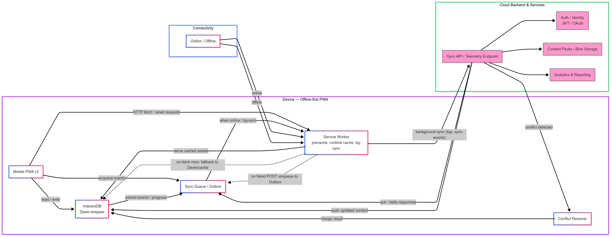
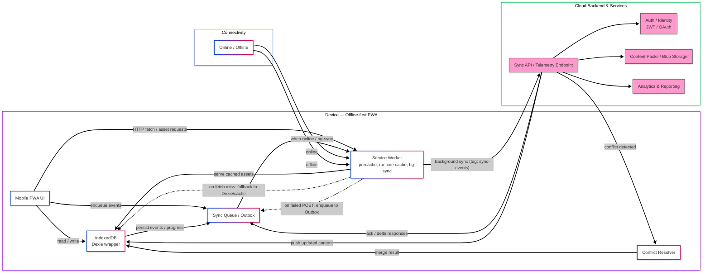

#️⃣ SANGYAAN — Smart Education Infrastructure for Digital India 🚀🇮🇳

SANGYAAN is an offline-first, gamified Progressive Web App (PWA) designed to bridge the rural education gap in India. It focuses on engagement, accessible STEM learning, and teacher-centred analytics — all optimized for low-cost Android devices.

✨ Core ideas: portable student profiles, verifiable badges (OpenBadges 3.0), modular content packs, multilingual UI (English / हिंदी / ଓଡ଼ିଆ), and teacher analytics.

---

## 🎯 Highlights

- Gamified learning: levels, XP, badges, mini-games and virtual labs 🏆🎮
- Offline-first: local-first storage with IndexedDB (Dexie), service worker caching, and background sync ⚡🗃️
- Teacher & parent dashboards: visual analytics, reports and classroom tools 📊👩‍🏫👨‍👧
- Lightweight & responsive: tuned for low-end Android phones and tablets 📱�️
- Multilingual: English + Hindi (Odia scaffolded) — extendable to other regional languages 🌐

---

## 🚀 Quick Start (Developer)

Run the app locally (from the `sangyaan` folder):

```bash
cd sangyaan
npm ci
npm run dev
```

Build for production:

```bash
cd sangyaan
npm run build
```

### Deployment options

- GitHub Pages — see `.github/workflows/deploy.yml` 🟢
- Netlify — configured by `netlify.toml` 🔁
- Vercel — `vercel.json` ▶️

## 📁 Where to look (key files)

- App root: `sangyaan/` (React + Vite)
- PWA entry: `sangyaan/index.html`, `sangyaan/public/manifest.json`
- Local DB: `sangyaan/src/db.js` (Dexie schema & helpers)
- Virtual labs & games: `sangyaan/src/components/VirtualLab.jsx`, `sangyaan/src/components/ChemistryLab.jsx`
- Quiz engine: `sangyaan/src/components/Quiz.jsx`
- Language system: `sangyaan/src/contexts/LanguageContext.jsx`
- Cloud stubs: `cloud/firebase.js`, `cloud/gpt_nano.js`
- Product docs: `files/PRD.txt`

---

## 🧩 Minimal MVP mapping

### Gamified modules (2–3 subjects)
- Physics simulations (gravity, motion): `VirtualLab.jsx` ⚙️
- Math puzzles (algebra, geometry): `Quiz.jsx` 🧮
- Chemistry matching: `ChemistryLab.jsx` 🔬

### Offline-first architecture
- IndexedDB via Dexie: `sangyaan/src/db.js` 🗃️
- PWA manifest + service worker scaffold: `sangyaan/public/manifest.json` + (recommended) `public/sw.js` 🖥️

### Analytics & dashboards
- Teacher dashboard: `sangyaan/src/components/TeacherDaashboard.jsx` 📊
- Parent dashboard: `sangyaan/src/components/ParentsDashboard.jsx` 👪

### UI & accessibility
- Tailwind configuration: `sangyaan/tailwind.config.js` 🎨
- Responsive components: `sangyaan/src/components/` 📱

---

## 🏗️ High-level architecture

Below is a simplified high-level architecture showing the offline-first flow, local storage, sync and cloud endpoints.



<details>
  <summary>Mermaid source (click to expand)</summary>



</details>


## 📄 Contributing

Please read `sangyaan/README.md` first for app-level developer notes. Open issues for features or bugs and include device/browser details when reporting offline/sync issues.

## 📝 License

See repository for license information.

